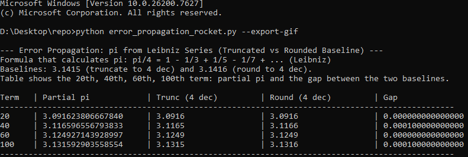
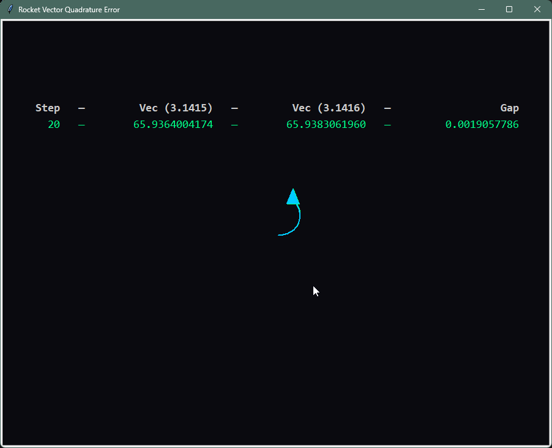
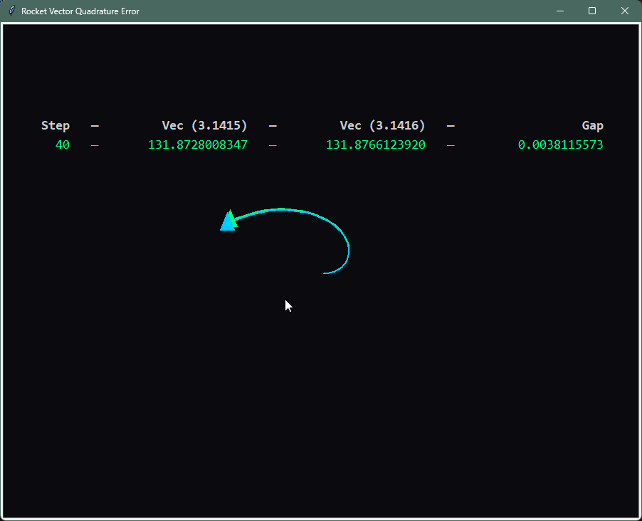
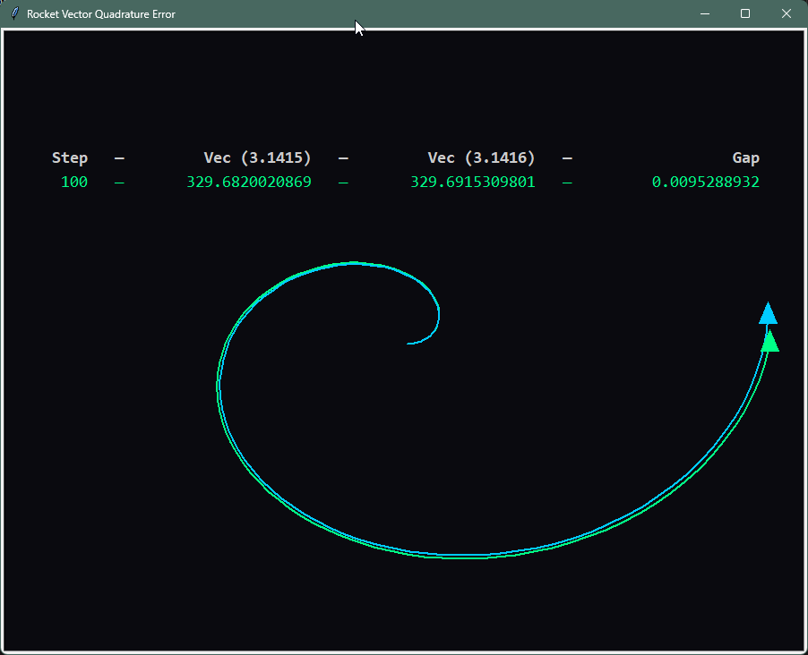
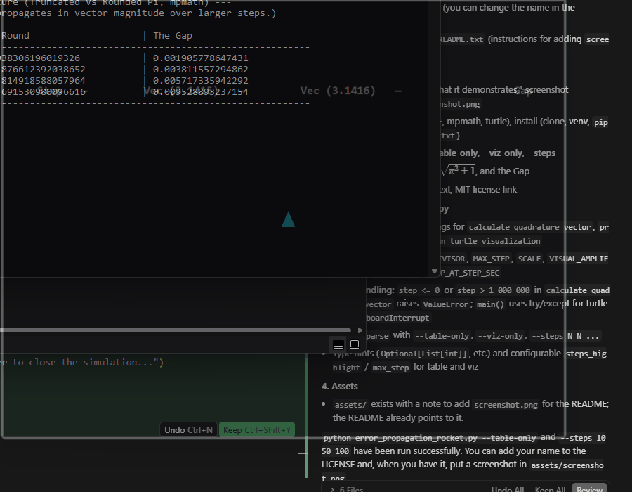

# Error Propagation Rocket


My Computational Lab Assignment about error propagation: how a tiny difference in π (3.1415 vs 3.1416) propagates through vector magnitude calculations.

## What It Demonstrates

This project illustrates **error propagation in numerical computation**. Using two common 4-decimal approximations of π—**truncated** (3.1415) and **rounded** (3.1416)—it shows how the resulting vector magnitude $\|\vec{v}\| = \sqrt{(\pi n)^2 + n^2}$ grows more sensitive to the value of π as the step count $n$ increases. The console table and turtle animation make the "gap" between the two results visible and intuitive.

## Visual Preview

### Console output

Running `python error_propagation_rocket.py --table-only` prints the comparison table:



### Turtle visualization (step-by-step)

**Step 20**



**Step 40**



**Step 60**


**Step 100**



### Animated preview



## Requirements

- **Python** 3.7 or higher
- **mpmath** (high-precision arithmetic)
- **turtle** (included in the Python standard library)

## Installation

1. Clone the repository:
   ```bash
   git clone https://github.com/yourusername/error_propagation_rocket.git
   cd error_propagation_rocket
   ```

2. (Recommended) Create and activate a virtual environment:
   ```bash
   python -m venv .venv
   .venv\Scripts\activate   # Windows
   # source .venv/bin/activate   # macOS/Linux
   ```

3. Install dependencies:
   ```bash
   pip install -r requirements.txt
   ```

## Usage

**Default (table then visualization):**
```bash
python error_propagation_rocket.py
```

**Options:**

| Flag | Description |
|------|-------------|
| `--table-only` | Print the comparison table and exit (no turtle window). |
| `--viz-only`   | Skip the table and run only the turtle visualization. |
| `--steps 20 40 60 100` | Override which steps are highlighted in the table and in the animation (space-separated integers). |

Examples:
```bash
python error_propagation_rocket.py --table-only
python error_propagation_rocket.py --viz-only
python error_propagation_rocket.py --steps 10 50 100
```

## Mathematical Explanation

We define a "rocket" vector in the plane whose horizontal component is $\pi \cdot n$ and vertical component is $n$ (where $n$ is the step index):

$$
\vec{v} = (\pi \cdot n,\, n)
$$

The magnitude (Euclidean length) is:

$$
\|\vec{v}\| = \sqrt{(\pi n)^2 + n^2} = n\sqrt{\pi^2 + 1}
$$

Using $\pi \approx 3.1415$ (truncated) vs $\pi \approx 3.1416$ (rounded) gives two slightly different magnitudes. The **Gap** in the table is the absolute difference between them:

$$\text{Gap} = \left| \lVert \vec{v}_{\text{round}} \rVert - \lVert \vec{v}_{\text{trunc}} \rVert \right|$$

As $n$ increases, this gap grows, illustrating how a small error in $\pi$ propagates through the formula.

## Features

- **Console comparison table** — Steps 1–100 with emphasis on 20, 40, 60, 100; columns: Step, Vec Trunc, Vec Round, The Gap.
- **Turtle animation** — Two trajectories (green = truncated π, cyan = rounded π) with amplified angle difference so the divergence is visible.
- **High-precision math** — Uses `mpmath` (50 decimal places) for accurate comparison.
- **Configurable steps** — Override which steps are highlighted via `--steps`.

## Educational Context

Suitable for:

- Computational or numerical methods labs
- Demonstrating **error propagation** and sensitivity to input precision
- Discussing **rounding vs truncation** (e.g. 3.1415 vs 3.1416)
- Visualizing small numerical differences in a memorable way

## Acknowledgments

This project was completed as part of a **computational lab assignment** to demonstrate error propagation and numerical sensitivity in vector calculations.

## License

This project is licensed under the **MIT License** — see the [LICENSE](LICENSE) file for details.
